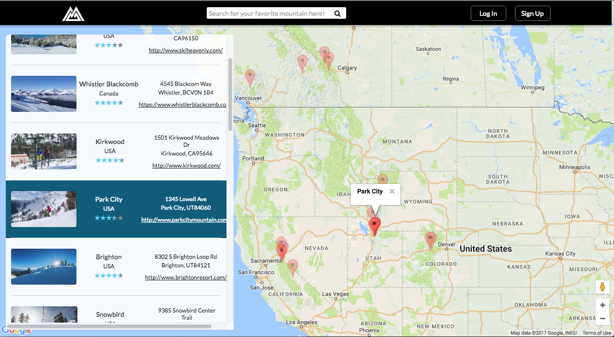
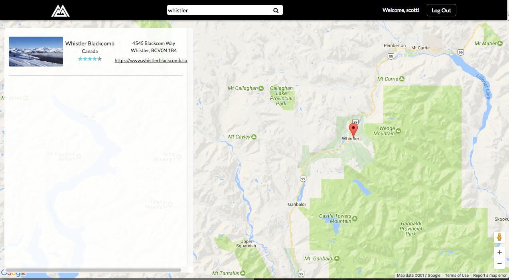
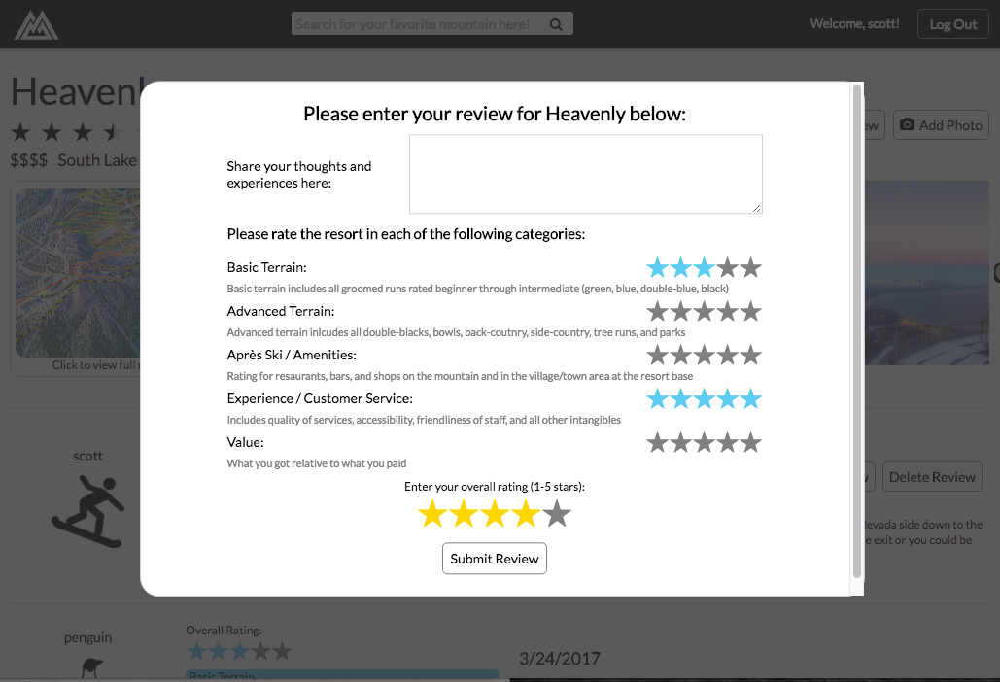
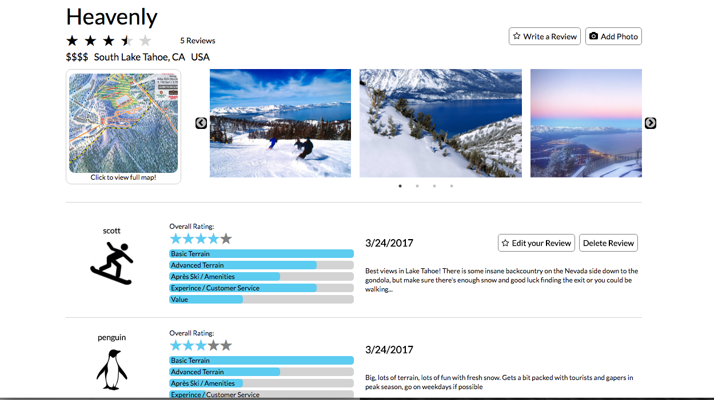

# Snowscape

[Snowscape live][snowscape]

[snowscape]: https://snowscape.herokuapp.com/#/
Snowscape, a search engine and review site for ski resorts, is a full-stack web application inspired by Yelp. It utilizes Ruby on Rails on the backend, a PostgreSQL database, and React.js with a Redux architectural framework on the front end.

## Features & Implementation

### Home

Snowscape is primarily focused on ski resorts, which are stored in a `resorts` table. The landing page for Snowscape features a embedded background video and a prominent search bar that allows users to search the `resorts` database by resort `name`. It also includes links to the detail pages for the 8 most popular resorts, which are determined by calculating the number of reviews for each resort and sorting on this total.

### Resort Search

Submitting data into the search bar (or clicking on the show all link on the home page) redirects users to the search results page, which features a background Google Maps interface with an index of the resorts with names that matches the user's search query overlaid and floating on the left side. This index includes information about the resort's location and website as well as its `avg_rating` displayed in stars. The search bar is still available but is relocated to a nav-bar at the top of the page (where it is located on all pages other than home).

Markers showing the location for each of the matched resorts are placed on the map with each new search. Hovering the mouse cursor over a marker on the map will open a Google Maps info window display the resort's `name`, and hovering over a resort in the index will highlight its location on the map by increasing the opacity for all other markers as well as displaying the info window. Clicking on either the marker or the index item will redirect the user to that resort's detail page.

<p align="center">
 
</p>

If the results of the user's search query only returns one resort, the map will automatically zoom and center on that resort's location (adjusted east to account for the portion of the map covered by the search index).

<p align="center">
 
</p>

Note that on the search page only, the results in the search index and the map markers are updated real-time as the user input's their search query. This was achieved using the same `search_bar` component that is used on all other pages by conditionally rendering the form using different hooks to trigger the form submit based on a `path` prop passed in from React Router. See code below:

```javascript
render() {
  if (this.props.path === "/resorts") {
    return(
      <form className={this.props.class} onKeyUp={this.handleSubmit}>
        {this.renderFormContent()}
      </form>
    );
  } else {
    return(
      <form className={this.props.class} onSubmit={this.handleSubmit}>
        {this.renderFormContent()}
      </form>
    );
  }
}
```

### Resort Detail

The main content for each resort is displayed on the resort's detail page. This page features a top section that includes details about the resort including:
  - `name`, `city`, `state`, `country`, `price_rating` (in $) and expandable on-click `trail_map_url` from the `resorts` table
  - `avg_rating` and `review_count` stats calculated from the `reviews` table
  - A scrolling carousel of the resort's photos, each expandable on-click, pulled from the `photos` table via ActiveRecord association
  - Buttons to write a new review and add a new photo, provided the user is logged in. The new review and new photo forms open in modals without changing the page.

<p align="center">
 
</p>

Below the main content is a list from the `reviews` table, also generated from the backend via association. Each review shows the reviewer's name and profile pic, their `overall_rating` in stars and rating bars that show the review's 5 sub-rating categories. If the current user logged-in is the author of any reviews, buttons to edit and delete the review are also shown.

<p align="center">
 
</p>

## Future Directions

### User Profile page and Favorites

I would like to add a user profile page which will include a list of all reviews they have written, photos they have posted, and resorts they have added as a `favorite` (a new property for resorts that will be connected to users via a join table).

### Map Regions and Sorting

Due to the fact that resort locations are clustered, yet spread out across the globe, I plan on also add a dropdown selector at the top of the resort index on the search map page that will allow users to select a region (North America, Europe, Japan, etc). Selecting a region will re-focus the map to show all resorts in that region.

I also would like to add the option to sort search results/resort index by some of the various mountain stats.
